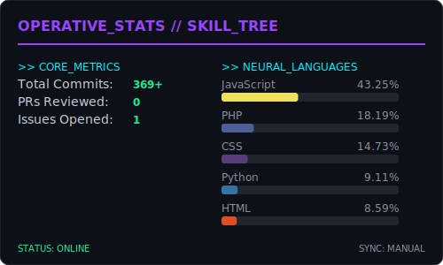
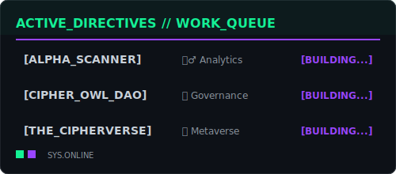

<!--
  Theme: Solana Netrunner (Vibecoder + Security + Crypto)
  Colors:
    - Background: #0D1117 (GitHub Dark Dimmed)
    - Solana Green: #14F195
    - Solana Purple: #9945FF
    - Cyber Cyan: #00F0FF
    - Glitch Red: #FF003C
-->

  <!-- Glitch Header -->
  

  <!-- Sub-Header / Typing Identity -->
  

   

  <!-- Social Badges (Solana Purple Style) -->
  
  
  

 

---

## 🐍 CHAIN_CONTRIBUTIONS

 
<picture>
  <source media="(prefers-color-scheme: dark)" srcset="https://raw.githubusercontent.com/EmperorLuxionVibecoder/EmperorLuxionVibecoder/output/github-contribution-grid-snake-dark.svg">
  <source media="(prefers-color-scheme: light)" srcset="https://raw.githubusercontent.com/EmperorLuxionVibecoder/EmperorLuxionVibecoder/output/github-contribution-grid-snake.svg">
  
</picture>
 

 

## � SIGNAL_FREQUENCY

  

 

---

## ⚔️ THE_ARMORY [Tech Stack]

<!-- On-Chain / Crypto (Solana Green & Purple) -->
<h3>🔮 On-Chain Protocols (Solana)</h3>

<!-- The Grid / Web2 (Dark & Clean) -->
<h3>🌐 The Grid (Web2)</h3>

<!-- Security / Red Team (Red & Black) -->
<h3>🛡️ Security Ops</h3>

 

<!--START_SECTION:waka-->
<!--END_SECTION:waka-->

---

## 📊 LIVE_NETWORK_METRICS

<!-- Main Metrics Dashboard (Base Stats) -->

  

---

## �🚧 ACTIVE_DIRECTIVES [WIP]

<!-- Active Directives / Work Queue -->

 

## 🌐 CIPHER_LABS_ECOSYSTEM

 

---

  
  <h3>📡 ENCRYPTED TRANSMISSION ENDED</h3>
  
  

    
  

  

    
    
    
  

   
  
  
  
  

    © 2026 EmperorLuxionVibecoder // ALL_RIGHTS_RESERVED
  

