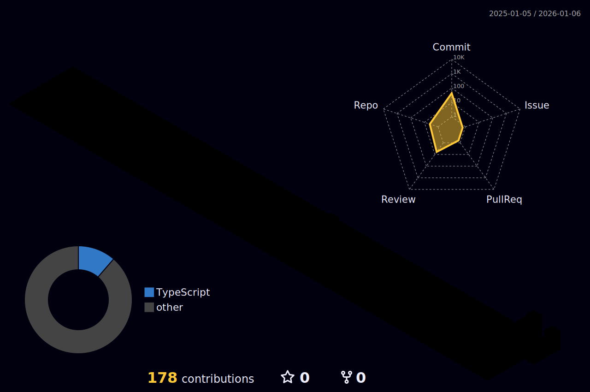

<div align="center">


[](https://x.com/EmperorLuxion)
[](https://github.com/EmperorLuxionVibecoder)

</div>

---

## 🚀 About Me

```bash
# 🖥️ TERMINAL SESSION: VIBECODER_HQ

luxion@vibecoder:~$ ./identify_user.sh
> [USER]: EmperorLuxion
> [CLASS]: FullStack Sorcerer 🔮
> [VIBE]: Cosmic Lo-fi & Syntax Errors 🌌

luxion@vibecoder:~$ cat system_status.log
> 🎵 MUSIC_VOL: 110% (Synthwave)
> ☕ CAFFEINE: CRITICAL LEVELS
> 🌑 THEME: DARK_MODE_V3.0

luxion@vibecoder:~$ sudo execute_workflow
> Running... 
> [SUCCESS] Pizza converted to Code 🍕➡️🟩
> [WARNING] "It works on my machine" protocol active.
```

<div align="center">

### ⚡ Daily Logic Laugh
<!--START_SECTION:joke-->
> "Java and C were telling jokes. It was C's turn, so he writes something on the wall, points to it and says \"Do you get the reference?\" But Java didn't."
<!--END_SECTION:joke-->


</div>

---

## 🛠️ Tech Stack

<div align="center">

### 💻 Languages


### 🎨 Frontend


### ⚙️ Backend


### 🗄️ Databases


### 🔧 Tools & Platforms


</div>


---

<!--START_SECTION:waka-->

```txt
Markdown   1 hr 20 mins    ████████████████████████░   96.16 %
Git        2 mins          ▓░░░░░░░░░░░░░░░░░░░░░░░░   03.08 %
YAML       0 secs          ▒░░░░░░░░░░░░░░░░░░░░░░░░   00.76 %
```

<!--END_SECTION:waka-->

---

## � Cyberpunk Statistics

<div align="center">
<!-- RPG Style Stats -->


<br/>
<br/>
<!-- Cyberpunk Metrics Dashboard -->


</div>

---

## 🐍 Contribution Snake

<div align="center">

<br/>

<picture>
  <source media="(prefers-color-scheme: dark)" srcset="https://raw.githubusercontent.com/EmperorLuxionVibecoder/EmperorLuxionVibecoder/output/github-contribution-grid-snake-dark.svg">
  <source media="(prefers-color-scheme: light)" srcset="https://raw.githubusercontent.com/EmperorLuxionVibecoder/EmperorLuxionVibecoder/output/github-contribution-grid-snake.svg">
  
</picture>

<br/>

<!-- 3D Graph -->


</div>


---

## 📫 Connect With Me

<div align="center">

[](https://x.com/EmperorLuxion)
[](https://github.com/EmperorLuxionVibecoder)
[](https://t.me/EmperorLuxion)

### 💬 Let's collaborate and build something amazing together! 


</div>


<div align="center">
  
### ⭐ Show some love by starring my repositories! ⭐

**Thanks for visiting! 🚀 Happy Coding! 💻**

<br/>

</div>
