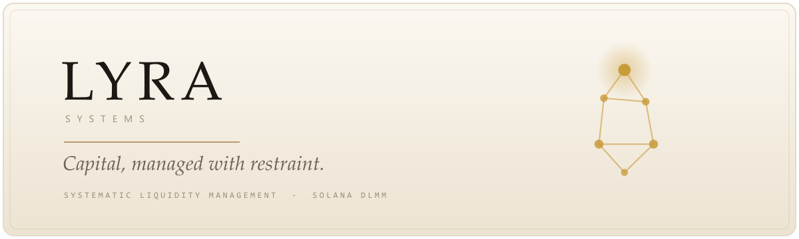
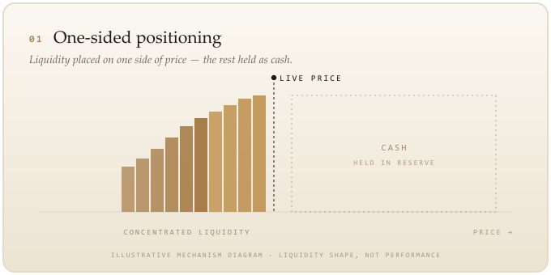
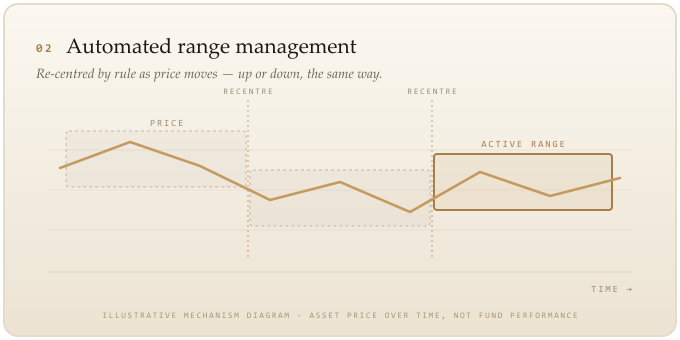
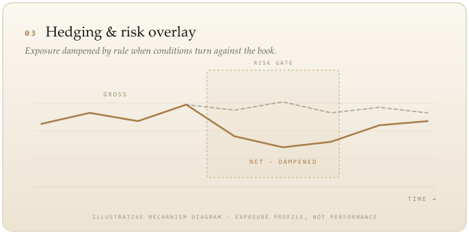
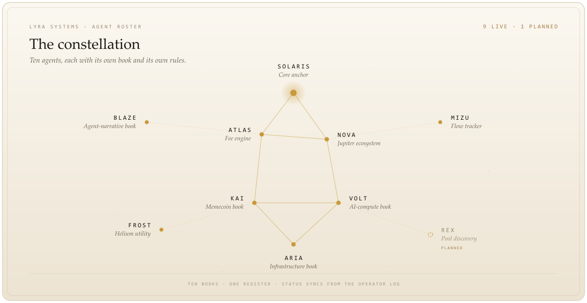
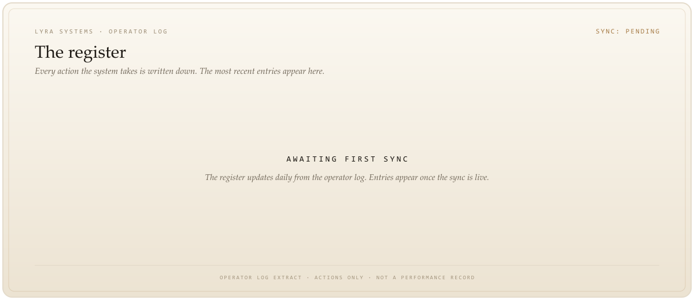

<!--
  Lyra Systems register — Bone & Bronze
  bone #F5F0E6 · paper #FBF8F1 · ink #1C1813 · mut #6B6253 · soft #9C8E76
  bronze #A87F4B · bronze-bright #C49A5E · gold #C99A3A · hairline #E4DBCB
  Fraunces (serif) + Inter (sans) + mono — matching lyra-systems.vercel.app
-->

  

 

  Active, automated liquidity on Solana's concentrated-liquidity (DLMM) infrastructure — 
  positioned on one side of price, re-centred by rule, with a risk overlay that dampens exposure.

 

---

### &nbsp;&nbsp;Three ideas at the centre

**How we operate.** The whole strategy reduces to three decisions, each made the same way every time.

 

**01 · One-sided positioning**

Conventional liquidity sits on both sides of price and is exposed either way. We place it on one side, around prices chosen in advance — exposure by intention, with the rest held as cash.

  

 

**02 · Automated range management**

A static position drifts out of range and stops working. Ours is re-centred automatically as the market moves — the same way every time, with no manual intervention.

  

 

**03 · Hedging & risk overlay**

On top of the positions, a risk-management overlay is designed to dampen exposure when conditions turn against us. Its job is to defend capital, not to chase returns.

  

 

---

### &nbsp;&nbsp;The constellation

Ten agents, each running its own book on individually optimized parameters. Node status syncs from the operator log.

  

  <i>Each agent has its own parameters, its own book — and, for reasons engineering has stopped questioning, its own personality.</i>

 

---

### &nbsp;&nbsp;How it works

**01** &nbsp;Capital is commingled in the operator wallet and deployed into one of the active pools.

**02** &nbsp;The system works it — reshapes, fee claims, harvests, and risk gates. Nothing happens at random; nothing happens without a rule.

**03** &nbsp;Every action is logged and NAV refreshes on a fixed snapshot — the same one every investor sees.

 

---

### &nbsp;&nbsp;The register

  

  Regenerated daily by a scheduled workflow. Actions only — the register is a log, not a performance claim.

 

---

### &nbsp;&nbsp;In development & planned

**04 · Additional venues** — Orca Whirlpools and Raydium CLMM, alongside Meteora DLMM.

**05 · USDC vault** — a conservative vault on Ranger Finance.

**06 · On-chain agent identity** — each agent registered via Metaplex.

**07 · Rex** — a pool-discovery agent working the Jupiter API.

**08 · Weekly reports** — public performance reports, net of costs, published together with the cost model.

**09 · The Nest** — an interactive 3D world where the agents live.

 

---

  SOLANA · RUST · ANCHOR · PYTHON · TYPESCRIPT · METEORA DLMM &nbsp;—&nbsp; systems &amp; tooling built under <a href="https://github.com/Cipherlabsx">CipherLabsX</a>

 

> **Disclosure.** Lyra Systems is an informal operator structure — no fund vehicle, no offering memorandum, participation by direct introduction only. Any numbers shown anywhere are realized to date and are not a commitment about future performance. Providing liquidity carries impermanent loss as well as broader market and smart-contract risk; you can lose some or all of your capital.

   
  <a href="https://lyra-systems.vercel.app">lyra-systems.vercel.app</a> &nbsp;·&nbsp; <a href="https://x.com/EmperorLuxion">@EmperorLuxion on X</a> &nbsp;·&nbsp; <a href="https://www.colosseum.org">Colosseum Frontier</a>
    
  <i>Capital, managed with restraint.</i>

