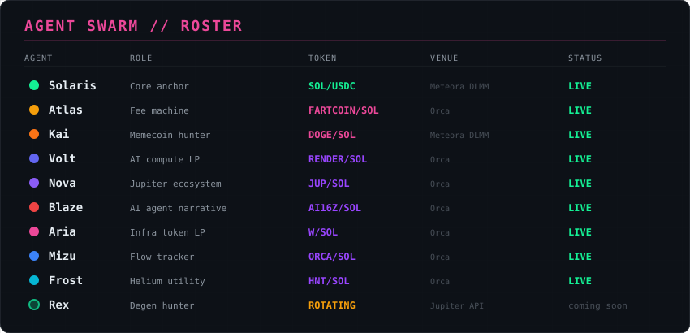

<!--
  Theme: Project Lyra
  Pink: #EC4899 | Purple: #9945FF | Green: #14F195
-->

<div align="center">

  

  <br/>

  

  <br/><br/>

  [](https://x.com/EmperorLuxion)
  [](https://github.com/Cipherlabsx)
  [](https://www.colosseum.org)

</div>

<br/>

---

<div align="center">

### What I'm Building

</div>

```
Project Lyra is an autonomous concentrated liquidity management system on Solana.

10 named AI agents, each specialized for a specific token.
Each with its own optimized parameters, role, and personality.
Each making independent entry, rebalance, and exit decisions.

Live on Meteora DLMM. Expanding to Orca Whirlpools and Raydium CLMM.

The tech is serious. The UX just happens to have pink hair.
```

<br/>

---

## Build Status

<div align="center">


</div>

<br/>

---

## The Agent Swarm

<div align="center">



</div>

<br/>

Each agent operates independently with:
- **Individually optimized parameters** from walk-forward backtesting across thousands of configurations
- **Its own persona and voice** so you can tell at a glance who did what and why
- **Adaptive range management** tuned to the volatility profile of its assigned token
- **IL circuit breakers** that trigger automatic protective exits

Performance numbers coming soon. We don't publish numbers without publishing the cost model.

<br/>

---

## Roadmap

```
LIVE NOW
  Meteora DLMM execution
  10-agent swarm architecture
  Walk-forward parameter optimization
  Risk management + circuit breakers

IN DEVELOPMENT
  Orca Whirlpool integration
  Raydium CLMM integration
  USDC vault on Ranger Finance
  On-chain agent identity via Metaplex

PLANNED
  Rex: degen pool discovery agent (Jupiter API)
  The Nest: 3D interactive world with VRM agent avatars
  Weekly public performance reports
```

<br/>

---

## Stack

<div align="center">


<br/>


<br/>


</div>

<br/>

---

## Activity

<div align="center">


</div>

<br/>

---

<div align="center">

  

</div>
