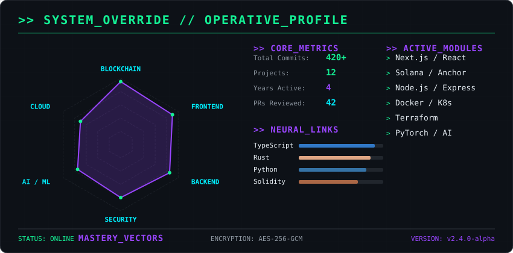
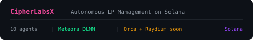

<!--
  Theme: Lyra LP Management / Orbit Finance / CipherLabsX
  Colors:
    - Background: #0D1117
    - Lyra Pink: #EC4899
    - CipherLabsX Purple: #9945FF
    - Solana Green: #14F195
    - Teal: #06B6D4
-->

<div align="center">

  

  <br/>

  

  <br/><br/>

  [](https://x.com/EmperorLuxion)
  [](https://github.com/EmperorLuxionVibecoder)
  [](https://github.com/Cipherlabsx)
  <br />
  

</div>

<br/>

---

### About

```
Founder @ CipherLabsX — building autonomous LP management and DeFi infrastructure on Solana.

Leading Project Lyra: a swarm of 10 AI agents that autonomously manage concentrated
liquidity across Meteora DLMM pools. Each agent has its own persona, risk parameters,
and mood engine. Every action is signed with on-chain Metaplex AgentIdentityV1 —
verifiable on any Solana explorer.

Previously: quantitative trading systems, financial administration, web development.
Now: full-time DeFi builder. Solana-native. On-chain verifiable.
```

<br/>

---

## Project Lyra — AI LP Management

<div align="center">

<table>
<tr>
<td width="55%">

**10 autonomous agents, each specialized for a coin:**

| Agent | Coin | APY | Sharpe | Win Rate |
|-------|------|-----|--------|----------|
| Rex | DOGE/SOL | 398% | 1.45 | 100% |
| Nova | XRP/SOL | 208% | 1.46 | 100% |
| Frost | AVAX/SOL | 141% | 1.04 | 96% |
| Kai | BNB/SOL | 127% | 1.01 | 100% |
| Aria | ADA/SOL | 113% | 1.76 | 100% |
| Blaze | HYPE/SOL | 84% | 1.81 | 100% |
| Mizu | SUI/SOL | 76% | 1.70 | 100% |
| Volt | ETH/USDC | 45% | 1.84 | 100% |
| Atlas | BTC/USDC | 29% | 2.46 | 100% |
| Solaris | SOL/USDC | — | — | — |

</td>
<td width="45%">

**728-day backtest (Blue Chip):**
- APY: **67-79.2%**
- Sharpe: **15.28**
- Win Rate: **100%** (104/104 OOS)
- Fee/IL: **9.16x**
- Max DD: **0.9%**
- Positive months: **24/24**

**On-chain identity:**
- Wallet: `GNxT3Q...NpMg`
- Metaplex: AgentIdentityV1
- Every trade auditable on [Solscan](https://solscan.io/account/GNxT3QVaeNsNkDn2bkBmcHLqPxUD4qpSkMLNJdpYNpMg)

[](https://github.com/Cipherlabsx/lyra)

</td>
</tr>
</table>

</div>

<br/>

---

## The Stack

<div align="center">

<h3>On-Chain (Solana)</h3>


<h3>Quant & LP Engine</h3>


<h3>Frontend & SDK</h3>


<h3>Infrastructure</h3>


<h3>Security</h3>


</div>

<br/>

---

## Contributions

<div align="center">

<picture>
  <source media="(prefers-color-scheme: dark)" srcset="https://raw.githubusercontent.com/EmperorLuxionVibecoder/EmperorLuxionVibecoder/output/github-contribution-grid-snake-dark.svg">
  <source media="(prefers-color-scheme: light)" srcset="https://raw.githubusercontent.com/EmperorLuxionVibecoder/EmperorLuxionVibecoder/output/github-contribution-grid-snake.svg">
  
</picture>

<br/><br/>


</div>

<br/>

---

## What I'm Building

<div align="center">

| Project | Description | Stack |
| :--- | :--- | :--- |
| **[Lyra](https://github.com/Cipherlabsx/lyra)** | AI LP management — 10-agent swarm for concentrated liquidity on Meteora DLMM. 67% APY, on-chain Metaplex identity. | `Python` `Solana` `Meteora` |
| **[Orbit Finance](https://app.cipherlabsx.com)** | Solana-native DLMM DEX with on-chain fee routing, NFT staking, and AI-powered LP management. Hacken audited. | `Anchor` `Next.js` `Fastify` |
| **[DLMM SDK](https://www.npmjs.com/package/@orbitfinance/dlmm)** | TypeScript SDK for Orbit Finance concentrated liquidity. Published on npm. | `TypeScript` `tsup` |
| **[Proof of Cipher](https://github.com/Cipherlabsx)** | AI safety scanner with on-chain Merkle root attestation + .cipher naming service. | `Anchor` `Rust` `Next.js` |
| **[Quant Engine](https://github.com/EmperorLuxionVibecoder/Quant)** | Quantitative trading platform — backtesting, live execution, portfolio management on Hyperliquid + Solana. | `Python` `FastAPI` `Docker` |

</div>

<br/>

---

## Live Stats

<div align="center">



</div>

<br/>

---

## Timeline

```
[2025-Present] >> Founder @ CipherLabsX
                  Building Orbit Finance (DLMM DEX) + Project Lyra (AI LP agents)
                  Solana mainnet: Fn3fA3fjsmpULNL7E9U79jKTe1KHxPtQeWdURCbJXCnM

[2024-2025]    >> Crypto Operations @ Coinmerce
                  High-volume transaction support, compliance protocols

[2021-2025]    >> Owner @ Administratiekantoor Lanooy
                  Financial administration, business consulting, automation

[2020-2025]    >> Owner @ Lanooy Webcreations
                  Full-stack development, SEO, digital solutions
```

<br/>

---

<div align="center">

  [](https://www.cipherlabsx.com)
  [](https://app.cipherlabsx.com)
  [](https://docs.cipherlabsx.com)

  <br/><br/>

  

  <br/>

  

</div>
